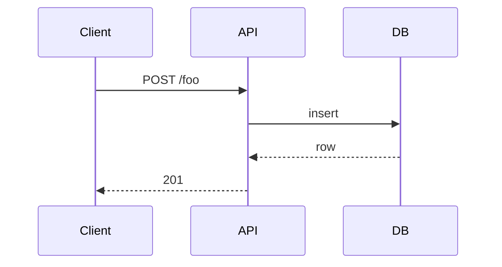

# REPLACE_WITH_TITLE

> **What's in this doc:** REPLACE_WITH_ONE_SENTENCE_LIST_OF_COVERED_TOPICS.
>
> **What's NOT:** REPLACE_WITH_EXCLUSIONS_AND_WIKILINKS_TO_OTHER_DOCS.

## REPLACE_WITH_FIRST_SECTION_HEADING

REPLACE_WITH_PROSE.

Cite code by `file:line`:

> Example: the request handler at `src/api/foo.ts:42` validates the body before calling `validateUser()` at `src/lib/auth.ts:118`.

If this section crosses ≥2 layers, open with a mermaid sequence diagram:

## REPLACE_WITH_SECOND_SECTION (if it cites schema/API/live behavior)

> Verified against REPLACE_WITH_SOURCE_OF_TRUTH on 2026-05-18.

| column | type | notes |
|---|---|---|
| ... | ... | ... |

<!-- verified-against: <exact query or query-summary> on 2026-05-18 -->
