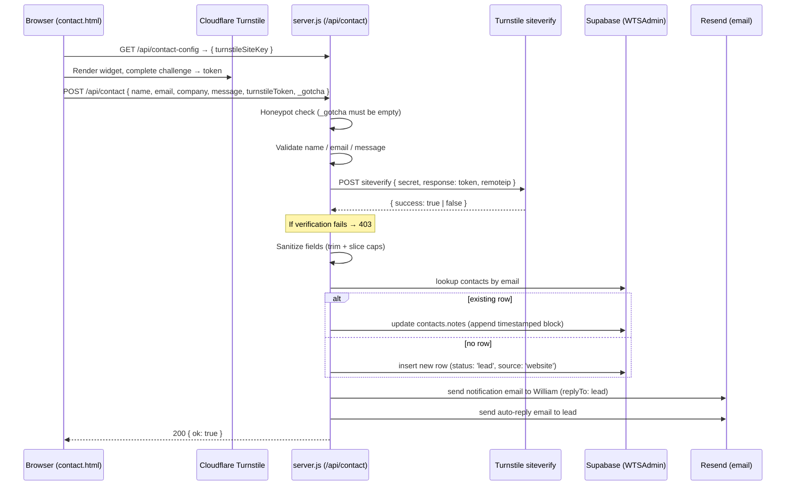

# Contact Form Flow

> **What's in this doc:** the full request/response path from the `contact.html` form submit through Express to Supabase + Resend + Cloudflare Turnstile, every required env var, validation rules, the upsert-on-email behaviour, and the failure-mode design.
>
> **What's NOT:** the chatbot endpoint (`/api/chat` — same Express server but unrelated; see [[chatbot]]), the deploy pipeline that ships `server.js` (Railway, not the DreamHost rsync — see [[deploy#pipeline-overview]]). The privacy notice on `privacy.html` was synced with this flow in the 2026-05-18 post-reframe-cleanup PR and now names Supabase / Resend / Cloudflare Turnstile / Railway accurately.

> **Also not in this doc:** the discovery-call booking widget added to `contact.html` on 2026-05-18 (a Google Calendar Appointment Schedule iframe). The booker bypasses `/api/contact` entirely — bookings write directly to William's Google Calendar and do not create a row in the WTSAdmin `contacts` table. The form path documented below is unchanged. Spec: `docs/superpowers/specs/2026-05-18-contact-booking-widget-design.md`. A v2 backlog item exists to mirror bookings into `contacts` via a Calendar-API poller.

The contact form is the primary conversion path for cold traffic that doesn't book Calendly. PR #3 (`feat/contact-to-wtsadmin`, merged 2026-05-17) replaced the old Formspree integration with a direct write into the WTSAdmin Supabase database, an email notification to William, and an auto-reply to the lead. The whole thing runs through the `/api/contact` endpoint in `server.js`.

---

## Request flow



The end-to-end happy path takes ~300–800ms depending on Turnstile latency. All three downstream services (Supabase, Turnstile, Resend) are independently failable, and the handler is written to degrade rather than fail — see "failure-mode design" below.

---

## Endpoints

### `GET /api/contact-config`

<!-- verified-against: server.js:70-74 on 2026-05-18 -->

```
GET /api/contact-config
→ 200 { turnstileSiteKey: string | null }
```

Returns the Turnstile **site key** (public by design — it ships to the browser anyway) so the form can render the widget. The site key lives in `TURNSTILE_SITE_KEY` env var. If unset, returns `null` and the form falls back to skipping the widget (the server will also skip verification in that case — dev/staging fallback).

The **secret key** (`TURNSTILE_SECRET_KEY`) is never exposed by this endpoint. It stays server-only.

### `POST /api/contact`

<!-- verified-against: server.js:167-325 on 2026-05-18 -->

```
POST /api/contact
Content-Type: application/json
Body: {
  name: string,                  // 2–200 chars after trim
  email: string,                 // RFC-ish via /^[^\s@]+@[^\s@]+\.[^\s@]+$/
  company?: string,              // optional, max 200 chars
  service_interest?: string,     // optional, max 100 chars (free-text track hint)
  message: string,               // 5–5000 chars after trim
  turnstileToken?: string,       // required in prod; skipped if no TURNSTILE_SECRET_KEY
  _gotcha?: string               // honeypot — must be empty/unset
}
→ 200 { ok: true }              // happy path (also returned silently when honeypot triggered)
→ 400 { error: '...' }           // validation failure (clear message for user)
→ 403 { error: 'Spam check failed...' }
→ 429 { error: 'Too many requests — please wait a moment.' }
```

Rate-limited 15 requests per IP per minute (shared limiter with `/api/chat` — see `server.js:49-59`).

---

## Validation rules

<!-- verified-against: server.js:188-204 on 2026-05-18 -->

| Field | Rule | Error if violated |
|---|---|---|
| `name` | string, ≥2 chars after trim | "Please enter your name." |
| `email` | matches `/^[^\s@]+@[^\s@]+\.[^\s@]+$/` | "Please enter a valid email address." |
| `message` | string, ≥5 chars after trim | "Please include a brief message." |
| `_gotcha` | must be empty/unset | _(silent — returns 200 to dissuade bot retries)_ |
| Turnstile | `turnstileToken` verifies via siteverify, OR `TURNSTILE_SECRET_KEY` not set (dev fallback) | "Spam check failed. Please refresh the page and try again." (HTTP 403) |

After validation, fields are sanitized (`server.js:207-212`):

- `name` → trim + slice(0, 200)
- `email` → trim + lowercase + slice(0, 200)
- `company` → trim + slice(0, 200), or `null` if empty
- `message` → trim + slice(0, 5000)
- `service_interest` → trim + slice(0, 100), or `null` if empty

---

## Supabase write — upsert on email

<!-- verified-against: server.js:222-263 on 2026-05-18 — Supabase JS client v2 using service-role key -->

The handler upserts into the **WTSAdmin** Supabase project's `contacts` table (NOT a WTS-marketing-site DB — this site has no DB of its own; it writes directly into the admin app's data store).

| Field | Source | Notes |
|---|---|---|
| `name` | form `name` | |
| `email` | form `email` | unique lookup key |
| `company` | form `company` or `null` | |
| `source` | `'website'` | hard-coded for this endpoint |
| `status` | `'lead'` | initial state — WTSAdmin manages transitions |
| `notes` | timestamped block (date, service_interest if any, message) | appended on subsequent submissions |

The lookup-then-write logic (`server.js:226-258`):

1. Query `contacts` for a row with `email = cleanEmail`.
2. If a row exists → append the new note block to existing `notes` (newline-separated).
3. If no row exists → insert a new row.

The newly-created or existing row's `id` (a UUID) is captured into `contactId` for inclusion in the notification email's deep link.

**Note:** the actual `contacts` table schema is defined and migrated in the WTSAdmin repo, not here. This server uses the Supabase service-role key (`WTSADMIN_SUPABASE_SERVICE_KEY`) which bypasses RLS. See WTSAdmin repo for table definition and column constraints.

### Failure mode

If the Supabase write fails (env var missing, network error, table missing), the handler **does not return an error to the user** (`server.js:259-263`). It logs the error to the server console (`[contact] Supabase write failed: <message>`) and continues to the email send. The rationale: if the DB is down, the email is the backup record — William can manually catch up the contact later from the notification email.

---

## Email — notification + auto-reply

<!-- verified-against: server.js:265-322 on 2026-05-18 — Resend SDK -->

Two emails sent for every successful submission, both via Resend:

### Notification (to William)

| Field | Value |
|---|---|
| `from` | `RESEND_FROM_EMAIL` env (default `noreply@williamtucker.ca`) wrapped as `William Tucker Solutions <{email}>` |
| `to` | `WTSADMIN_NOTIFY_EMAIL` env (default `william@williamtucker.ca`) |
| `replyTo` | The lead's email (so William can hit Reply and respond directly) |
| `subject` | `New website enquiry from {name}` + optional service-interest suffix |
| body | Plain text: lead's name, email, company, service interest, message, plus a deep link to the contact in admin (or a note if Supabase write failed) |

### Auto-reply (to lead)

| Field | Value |
|---|---|
| `from` | Same as notification |
| `to` | The lead's email |
| `subject` | `Got your message — I'll reply within 1 business day` |
| body | First-name greeting, confirmation, fallback email address, signature |

Both emails are best-effort: if Resend errors, the handler logs and continues. The lead is already in Supabase at that point so the data isn't lost.

---

## Required environment variables

<!-- verified-against: server.js env reads + .env.example (if present) on 2026-05-18 -->

Set these on Railway (the server's deploy target — NOT in DreamHost or anywhere the static site is served).

| Var | Purpose | Behavior if missing |
|---|---|---|
| `ANTHROPIC_API_KEY` | `/api/chat` only | Chatbot returns 500; doesn't affect contact form |
| `WTSADMIN_SUPABASE_URL` | Supabase project URL for WTSAdmin DB | DB write fails (handler logs + continues) |
| `WTSADMIN_SUPABASE_SERVICE_KEY` | Service-role key for the same project | Same as above |
| `WTSADMIN_NOTIFY_EMAIL` | Inbox for the notification email | Falls back to `william@williamtucker.ca` |
| `RESEND_API_KEY` | Resend SDK auth | Emails fail to send (handler logs + continues) |
| `RESEND_FROM_EMAIL` | Sender address for both emails | Falls back to `noreply@williamtucker.ca` |
| `TURNSTILE_SITE_KEY` | Public Cloudflare Turnstile site key (returned to browser via `/api/contact-config`) | Form skips widget rendering; server skips verification (dev fallback) |
| `TURNSTILE_SECRET_KEY` | Secret used to call siteverify | Server skips verification with a `console.warn` (dev fallback only) |
| `PORT` | Server bind port | Falls back to `3000` |

Production deploys MUST set `TURNSTILE_SECRET_KEY` — without it, the contact form is unprotected against bot spam.

The `.env.example` file at the repo root lists these (verify on next edit). Local dev: copy `.env.example` to `.env`, fill in dev values, and the server reads it via `dotenv.config()`.

---

## Anti-spam layers (in firing order)

1. **Honeypot field `_gotcha`** (`server.js:185`) — invisible to humans, filled by naive bots. Returns 200 silently so the bot doesn't retry.
2. **Validation** (`server.js:188-196`) — too-short name / invalid email / too-short message rejected with 400.
3. **Cloudflare Turnstile** (`server.js:199-204`) — the actual challenge. Frictionless for humans, blocks scripted submissions.
4. **Rate limit** (`server.js:169-171`) — 15 requests / IP / minute. Shared with `/api/chat`.

If any of layers 2–4 fail, the lead never reaches Supabase or Resend.

---

## Frontend contract

The form on `contact.html:165-215` POSTs to `/api/contact` with the JSON body shape documented above. The Turnstile widget is rendered using the public site key fetched from `/api/contact-config`. The script that wires this up lives in the inline `<script>` block at the bottom of `contact.html` (verify on next edit — JS file path may vary).

CORS allows the static site origin (`williamtucker.ca`, `www.williamtucker.ca`, plus `localhost:3000` for dev) via the middleware in `server.js:16-29`. Any other origin can't read the response.

---

## Backlog

- ~~**`privacy.html` references Formspree + Calendly.**~~ Resolved in the 2026-05-18 post-reframe-cleanup PR — privacy notice now names Supabase / Resend / Cloudflare Turnstile / Railway.
- **The Supabase service-role key bypasses RLS.** If the WTSAdmin team adds RLS to the `contacts` table that should apply to this insert path, this server's write will fail. Coordinate with WTSAdmin owner before tightening RLS.
- **No dedupe on rapid resubmits.** A user double-clicking submit will create two `notes` entries on the same contact. Not a real issue at current scale; flag if it shows up in admin.
- **No retry logic on Resend failures.** A transient Resend outage drops the email silently (logged only). Could add a simple exponential-backoff retry, but the DB write covers data preservation so it hasn't been a priority.
