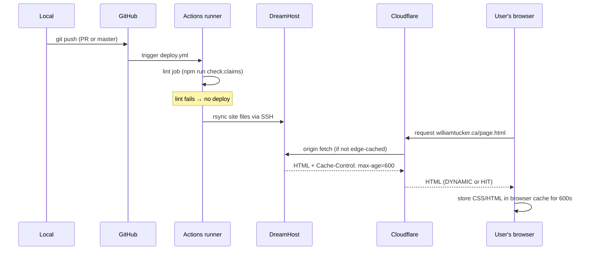

# Deployment & Caching

> **What's in this doc:** how a push to `master` becomes a live deploy at williamtucker.ca — the GitHub Actions workflow, the rsync to DreamHost, the Cloudflare CDN layer, browser caching behaviour, the CSS cache-busting discipline that every CSS-affecting commit must follow, and the chatbot proxy hosted separately on Railway.
>
> **What's NOT:** the contact-form endpoint env config (→ [[contact-flow]]), the build-time linter that gates deploys (→ [[linter]]), or the marketing-site CDN cache rules for individual assets (everything's served with `max-age=600` — no per-asset overrides).

The deploy pipeline is intentionally simple — three independently-cached layers (origin → Cloudflare → browser), one rsync, one GitHub Action. Most caching failures show up at the browser layer; understanding the layer ordering is what makes them debuggable.

---

## Pipeline overview



Three independent caches sit between a deploy and what the user actually sees:

1. **DreamHost origin** — updated synchronously by the rsync step. Refreshes on every successful master push.
2. **Cloudflare edge** — sits in front of the origin. Header `cf-cache-status` indicates whether the response came from edge (`HIT`/`MISS`) or passed through (`DYNAMIC`). At time of writing, HTML responses report `DYNAMIC` — verified 2026-05-18 via `curl -sI https://williamtucker.ca/contact.html`.
3. **Browser cache** — the trickiest layer. `Cache-Control: max-age=600` (set by DreamHost) means every modern browser holds the response for up to 10 minutes regardless of subsequent server-side changes. iPhone Safari "private browsing" does NOT bypass this fully — incognito tabs opened during a cache window may reuse the cached resource.

The 2026-05-17 incident that drove this doc's creation was a missed CSS layer at level 3: the HTML referenced `css/styles.css` (no version), so even when a new HTML deployed and the user fetched it fresh, the browser reused the cached CSS from the previous deploy. The cache-busting discipline below exists to prevent that.

---

## GitHub Actions workflow

<!-- verified-against: `.github/workflows/deploy.yml` on 2026-05-18 -->

Source: `.github/workflows/deploy.yml`.

Two jobs run on every push to `master` and on every PR targeting `master`:

| Job | When it runs | Purpose | Cite |
|---|---|---|---|
| `lint` | Every push + every PR | Runs `npm run check:claims` (the credibility linter). Failure blocks deploy. | `.github/workflows/deploy.yml:10-21` |
| `deploy` | Only on push to master (gated by `needs: lint`) | SSH key setup + rsync to DreamHost | `.github/workflows/deploy.yml:23-56` |

The rsync command excludes a lot — anything not part of the public site does not ship:

```
rsync -avz --delete \
  --exclude='.git' --exclude='.github' \
  --exclude='tailwind.config.js' --exclude='src' \
  --exclude='docs' --exclude='tests' --exclude='scripts' \
  --exclude='.env' --exclude='node_modules' \
  --exclude='server.js' \
  --exclude='package.json' --exclude='package-lock.json' \
  --exclude='CLAUDE.md' \
  -e "ssh -i ~/.ssh/deploy_key" \
  ./ dh_xjct9a@pdx1-shared-a4-03.dreamhost.com:/home/dh_xjct9a/williamtucker.ca/
```

What this means in practice:
- `server.js` is **not** deployed by this pipeline. The Express server runs on Railway, deployed separately when `master` changes there (see Railway dashboard).
- `--delete` means files removed from the repo are removed from DreamHost on the next deploy. PR #6 accidentally committed 134 local-tooling files; PR #7 removed them; the deploy after PR #7 wiped them off DreamHost. **This is the reason `git add -A` is dangerous in this repo** — see [[positioning#never-git-add--a-in-this-repo]].

Secrets:
- `secrets.DREAMHOST_SSH_KEY_LAPTOP` — the private SSH key authorized for `dh_xjct9a@pdx1-shared-a4-03.dreamhost.com`. Configured in GitHub repo settings → Actions → Secrets.

---

## CSS cache-busting discipline

**This is the most important section in this doc. Failing to follow it makes deploys appear broken to users.**

`css/styles.css` is referenced from every HTML page. Without a version query string on the href, browsers will reuse the cached CSS even after a fresh deploy, leaving new HTML classes with no CSS rules to bind to.

### The rule

Every HTML file's stylesheet link looks like this — `contact.html:19`:

```html
<link rel="stylesheet" href="css/styles.css?v=20260517b" />
```

The `?v=YYYYMMDDx` query string is the cache-buster. **Every commit that adds new Tailwind utility classes (or otherwise changes CSS output) MUST bump the version in lockstep, across all 8 HTML pages.**

Naming convention: `?v=YYYYMMDD<letter>` where `<letter>` increments through the day. First deploy on 2026-05-17 → `?v=20260517a`. Second → `?v=20260517b`. Next day starts fresh at `?v=20260518a`.

### Why this is required

Tailwind generates utilities lazily — only classes that appear in source files end up in `css/styles.css`. If a PR adds `class="order-1 md:order-2"` to an HTML element, the `.order-1` and `.md\:order-1` rules are NEW in CSS. Browsers serving the old cached CSS won't have those rules. The new HTML class is a no-op.

### How to bump correctly

When you ship any change that modifies CSS:

1. Pick the next version letter (check the current value in any HTML file).
2. Use `sed` to update all 8 HTML files in one pass:
   ```bash
   for f in *.html; do
     sed -i 's|css/styles.css?v=YYYYMMDDold|css/styles.css?v=YYYYMMDDnew|' "$f"
   done
   ```
3. Verify with `grep -c "css/styles.css?v=YYYYMMDDnew" *.html` — expect `8`.
4. Run `npm run build` to recompile `css/styles.css` so the new utilities are present.
5. Commit both `*.html` and `css/styles.css` together.

The 2026-05-17 incident's worst sub-failure was PR #8 only bumping `contact.html` (the file being edited) and leaving 7 pages on the previous `?v=`. Those 7 pages continued serving stale CSS to returning visitors until natural expiration. The current vault state has all 8 pages on `?v=20260517b` — **verify with the grep above before any new bump**.

### What does NOT need a bump

- Pure copy edits (HTML text changes that use existing utility classes already in the CSS)
- Image swaps
- JS-only changes
- `prompts/chatbot-system.md` edits (server-side)

If you're unsure whether your change touched CSS: run `npm run build`, then `git diff css/styles.css`. If the diff is non-empty (beyond whitespace), bump the cache-buster.

---

## Build command

<!-- verified-against: `package.json` scripts on 2026-05-18 -->

From `package.json:9`:

```
"build": "npm run check:claims && npx @tailwindcss/cli -i src/input.css -o css/styles.css --minify"
```

Two phases:
1. **Lint gate.** `npm run check:claims` — if any forbidden-phrase pattern fires, the build exits non-zero and the deploy never runs. See [[linter]].
2. **Tailwind compile.** Reads `src/input.css`, scans the repo for utility classes, writes minified `css/styles.css`.

The GitHub Actions deploy job does NOT run `npm run build` — it only runs `npm run check:claims` and then rsyncs the existing `css/styles.css` from the commit. **This means you must commit a freshly-built `css/styles.css` whenever your HTML changes the set of utilities in use.** A future improvement (not yet implemented) would be to run `npm run build` in CI and commit the resulting CSS, but currently the build is a manual local step.

---

## Cloudflare layer

Cloudflare DNS proxies williamtucker.ca. Response headers always include:

```
Server: cloudflare
Cache-Control: max-age=600
cf-cache-status: DYNAMIC
```

`DYNAMIC` means Cloudflare didn't cache this response — every request goes through to DreamHost origin. So Cloudflare is currently a DNS + DDoS layer here, not an aggressive cache.

If `cf-cache-status` ever changes to `HIT`, edge purging may become necessary on deploys. Today it isn't.

To verify what's actually being served to a user agent:

```bash
curl -sI https://williamtucker.ca/contact.html
curl -s -A "Mozilla/5.0 (iPhone; CPU iPhone OS 17_0 like Mac OS X) AppleWebKit/605.1.15" https://williamtucker.ca/contact.html | grep order-
```

When debugging "user says it didn't update", check headers FIRST — `last-modified`, `cf-cache-status`, `Cache-Control` — before suspecting the deploy.

---

## Debugging cache problems (the 2026-05-17 playbook)

If a user reports "I deployed but my phone still shows the old page", work the layers in order:

| Layer | What to check | How |
|---|---|---|
| 1. Git | Did the commit land on master? | `git log master --oneline -5` |
| 2. Deploy | Did the GitHub Actions run succeed? | `gh run list --branch master --limit 1` |
| 3. Origin | Does the file on DreamHost have the change? | `curl -s https://williamtucker.ca/path | grep <expected-marker>` |
| 4. Cloudflare | Is anything edge-cached? | `curl -sI <url>` — look at `cf-cache-status` |
| 5. CSS link | Did the cache-buster bump in the HTML? | `curl -s <html-url> | grep styles.css` |
| 6. CSS content | Does the bumped CSS file have the new utilities? | `curl -s <css-url> | grep <new-class>` |
| 7. User browser | Force fresh fetch with a unique URL | Append `?nocache=$(date +%s)` to test |

The 2026-05-17 incident failed at layer 5 — origin had the change, browser ignored it.

---

## What's intentionally NOT here

- **No staging environment.** DreamHost has one slot, which is production. There is no `preview.williamtucker.ca` or equivalent. Local `npm start` is the only pre-prod check. See [[positioning#deploy-discipline-do-not-bypass]] for the matching "never merge without local-test approval" rule.
- **No Vercel preview deploys.** The site is not a Vercel project. WTSAdmin (a different repo, `D:\code\wtsadmin`) is on Vercel; do not confuse them.
- **No automated build-in-CI for Tailwind.** Local `npm run build` writes `css/styles.css` and you commit it. Drift between source `*.html` classes and committed `css/styles.css` is silent until you check.

---

## Backlog

- The CI ought to run `npm run build` and verify the committed `css/styles.css` matches what would be regenerated. If they diverge, the build should fail. (Not implemented.)
- A pre-commit hook that auto-bumps the cache-buster when `css/styles.css` changes would prevent the "I forgot to bump" failure mode. (Not implemented.)
- The deploy currently has no rollback story. If a bad master push goes live, the recovery path is "revert + push + wait for next deploy run". A pinned-tag rollback workflow would be cheap to add.
